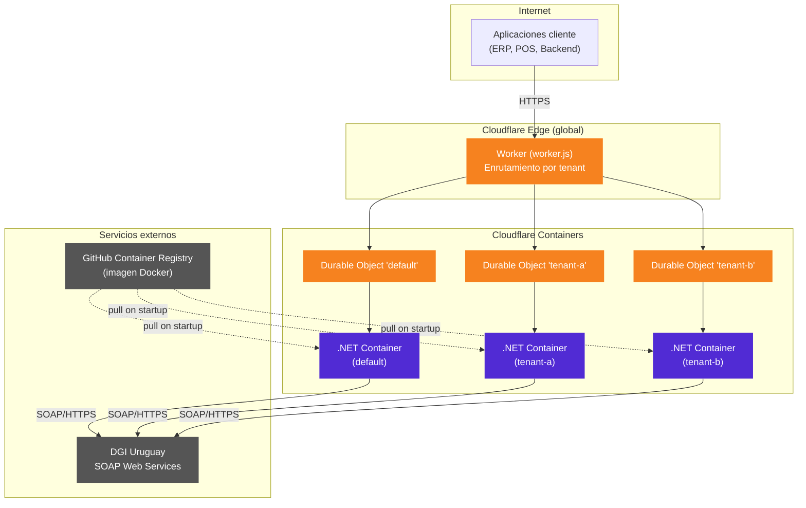
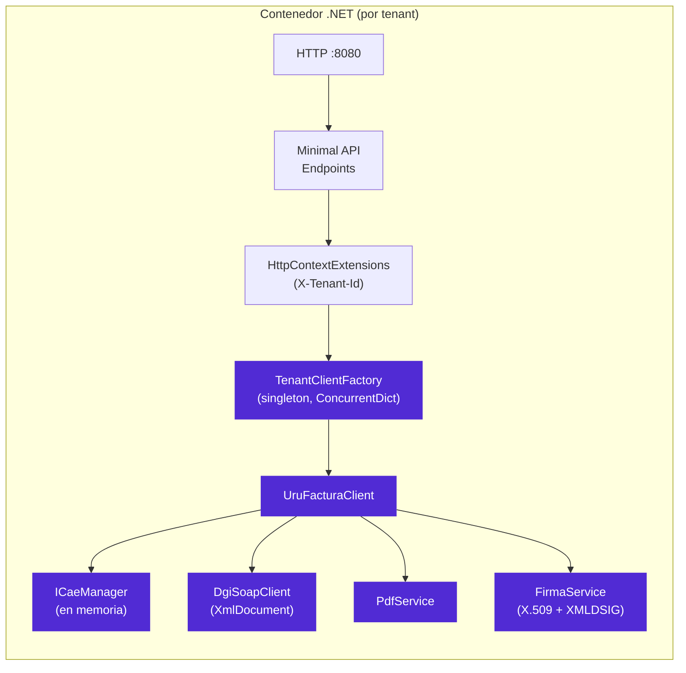
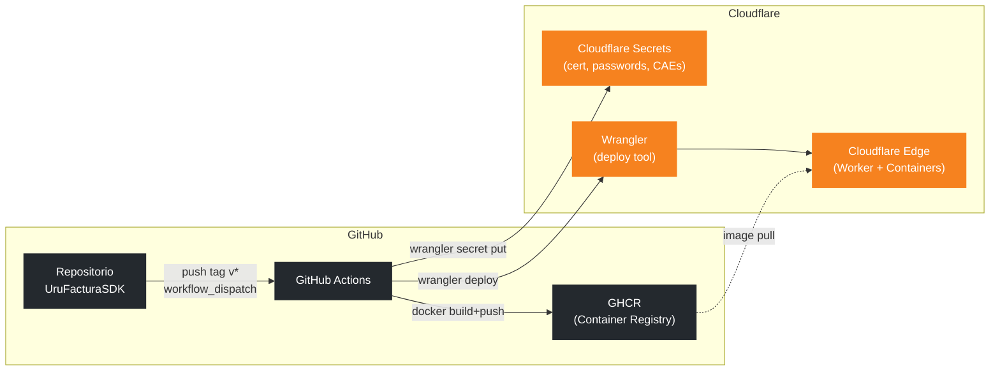
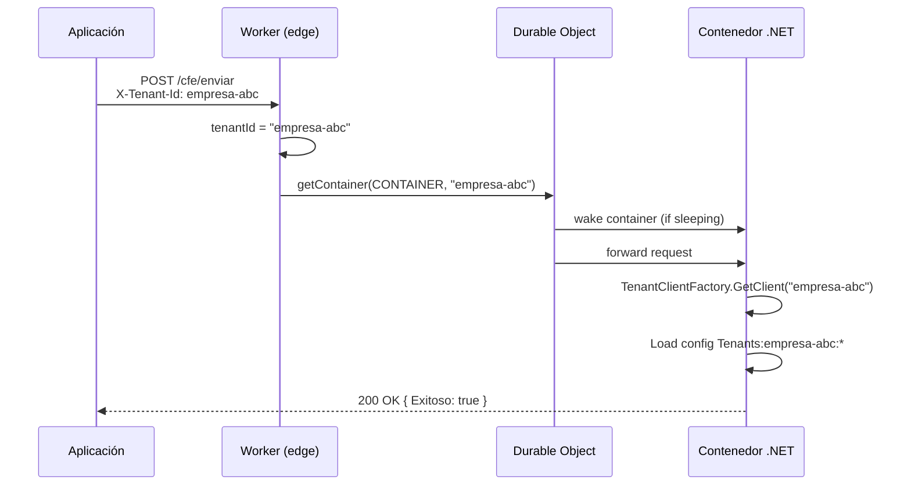
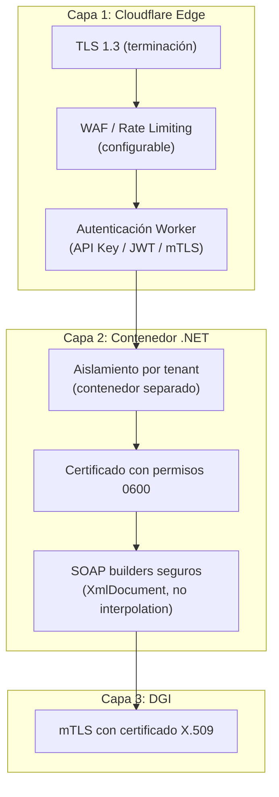
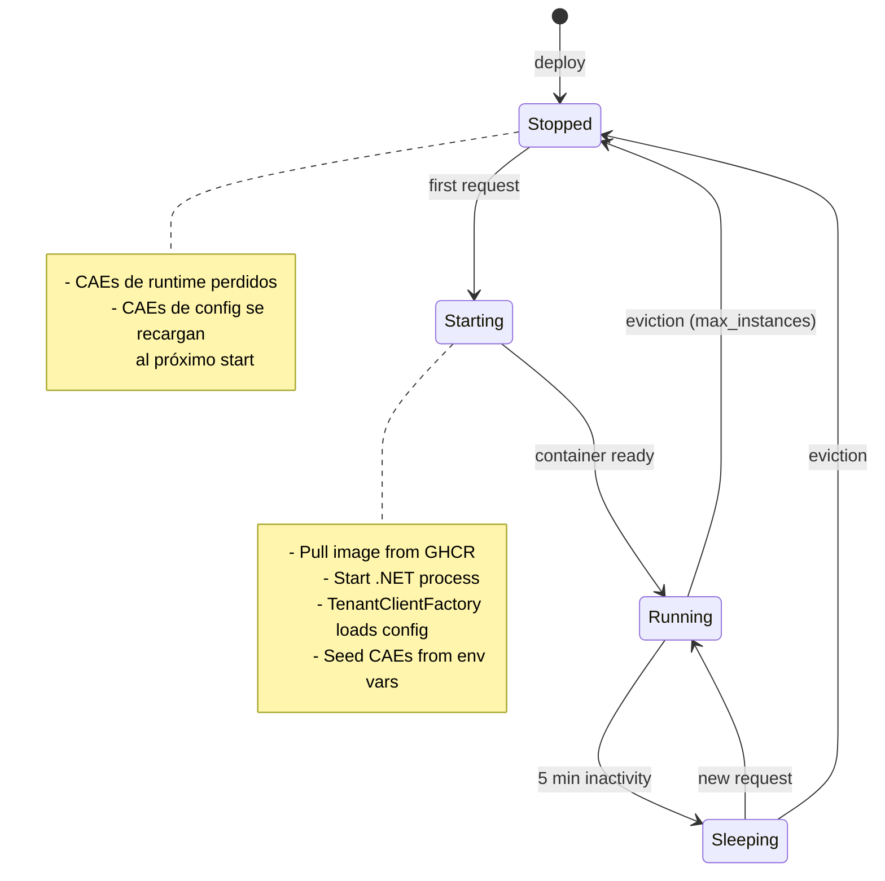

# Arquitectura — UruFactura CloudflareApi

Documento técnico que describe la arquitectura desplegada, los requerimientos de infraestructura y las capacidades de la API.

---

## Índice

- [Visión general](#visión-general)
- [Componentes del sistema](#componentes-del-sistema)
- [Modelo de despliegue](#modelo-de-despliegue)
- [Modos de operación](#modos-de-operación)
- [Requerimientos](#requerimientos)
- [Capacidades](#capacidades)
- [Seguridad](#seguridad)
- [Escalabilidad y límites](#escalabilidad-y-límites)
- [Ciclo de vida del contenedor](#ciclo-de-vida-del-contenedor)
- [Gestión de estado](#gestión-de-estado)
- [Pipeline CI/CD](#pipeline-cicd)
- [Decisiones de diseño](#decisiones-de-diseño)

---

## Visión general

**UruFactura.CloudflareApi** es una API HTTP que expone las capacidades del SDK de facturación electrónica uruguaya (`UruFacturaSDK`) como un servicio desplegable en [Cloudflare Containers](https://developers.cloudflare.com/containers/). Soporta operación single-tenant y multi-tenant (SaaS) desde la misma imagen Docker.

---

## Componentes del sistema

### 1. Cloudflare Worker (`cloudflare/worker.js`)

| Aspecto | Detalle |
|---------|---------|
| **Rol** | Punto de entrada público. Recibe todas las solicitudes HTTP y las enruta al contenedor correcto. |
| **Enrutamiento** | Usa el header `X-Tenant-Id` para seleccionar el Durable Object. Sin header → `"default"`. |
| **Runtime** | Cloudflare Workers (V8 isolate, edge global). |
| **Responsabilidades** | Enrutamiento, TLS termination, rate limiting (configurable vía Cloudflare), y opcionalmente autenticación a nivel Worker. |

### 2. Durable Objects

| Aspecto | Detalle |
|---------|---------|
| **Rol** | Gestionan el ciclo de vida de cada contenedor (start, sleep, wake, stop). |
| **Aislamiento** | Cada tenant recibe un Durable Object con nombre único → un contenedor dedicado con estado en memoria completamente aislado. |
| **Sleep** | El contenedor se duerme automáticamente tras 5 min de inactividad (`sleepAfter = "5m"`). |

### 3. Contenedor .NET (`UruFactura.CloudflareApi`)

| Aspecto | Detalle |
|---------|---------|
| **Framework** | ASP.NET Core 10 Minimal API |
| **Puerto** | 8080 (`ASPNETCORE_HTTP_PORTS`) |
| **Imagen base** | `mcr.microsoft.com/dotnet/aspnet:10.0` (Alpine) |
| **Dependencia principal** | `UruFacturaSDK` (firma XML, SOAP, PDF, gestión de CAEs) |

### 4. DGI (Dirección General Impositiva)

| Aspecto | Detalle |
|---------|---------|
| **Protocolo** | SOAP sobre HTTPS |
| **Endpoints** | `efactura.dgi.gub.uy` (Producción) / `efactura.dgi.gub.uy:6443` (Homologación) |
| **Operaciones** | Envío de sobres CFE, consulta de estado, reporte diario |
| **Autenticación** | Certificado digital X.509 (`.p12`) emitido por Correo Uruguayo |

---

## Modelo de despliegue

### Artefactos desplegados

| Artefacto | Destino | Actualización |
|-----------|---------|---------------|
| `worker.js` + `wrangler.toml` | Cloudflare Workers | `wrangler deploy` |
| Imagen Docker (ASP.NET) | GHCR → Cloudflare Containers | Tag SHA en `wrangler.toml` |
| Secretos (cert, passwords) | Cloudflare Secrets | `wrangler secret put` |
| Variables no-sensibles | `wrangler.toml [vars]` | `wrangler deploy` |

---

## Modos de operación

### Single-tenant

- Una empresa, un certificado digital, un conjunto de CAEs.
- Configuración bajo `UruFactura__*` (variables de entorno).
- No requiere header `X-Tenant-Id`.
- Todas las solicitudes van al Durable Object `"default"` → un solo contenedor.

### Multi-tenant (SaaS)

- Múltiples empresas con aislamiento completo.
- Cada tenant tiene su propia configuración bajo `Tenants__{id}__*`.
- Cada solicitud incluye `X-Tenant-Id: {tenantId}`.
- Cada tenant recibe su propio Durable Object → su propio contenedor → estado en memoria aislado.
- `max_instances` en `wrangler.toml` debe ser ≥ al número de tenants concurrentes.

---

## Requerimientos

### Infraestructura

| Componente | Requisito |
|------------|-----------|
| **Cloudflare** | Cuenta con plan Workers Paid + acceso a Containers (beta) |
| **GHCR** | Repositorio con GitHub Packages habilitado |
| **Certificado DGI** | `.p12` emitido por CA autorizada (Correo Uruguayo) por cada empresa emisora |
| **CAEs** | Al menos un CAE vigente por tipo de CFE que se vaya a emitir |

### Herramientas (desarrollo / CI)

| Herramienta | Versión mínima | Uso |
|-------------|---------------|-----|
| .NET SDK | 10.0 | Build de la API |
| Docker | 24+ | Build de imagen |
| Wrangler CLI | 3+ | Deploy a Cloudflare |
| Node.js | 20+ | Wrangler runtime |

### Secretos GitHub Actions

| Secret | Descripción |
|--------|-------------|
| `CLOUDFLARE_API_TOKEN` | Token API con permisos Workers Scripts + Containers |
| `CLOUDFLARE_ACCOUNT_ID` | ID de la cuenta Cloudflare |
| `URUFACTURA_RUT_EMISOR` | RUT del emisor (12 dígitos) |
| `URUFACTURA_RAZON_SOCIAL` | Razón social |
| `URUFACTURA_DOMICILIO_FISCAL` | Domicilio fiscal |
| `URUFACTURA_CERT_B64` | Certificado `.p12` codificado en Base64 |
| `URUFACTURA_CERT_PASSWORD` | Contraseña del certificado |
| `URUFACTURA_CAES` | JSON array de CAEs (opcional) |

### Configuración del contenedor

El contenedor lee configuración exclusivamente de variables de entorno (inyectadas como Cloudflare Secrets o `[vars]` en `wrangler.toml`). El proveedor de configuración de .NET traduce `__` a `:` automáticamente.

**Restricción de tenant IDs:** no pueden contener `:` ni `__` (separadores del proveedor de configuración .NET).

---

## Capacidades

### Tipos de CFE soportados (13 de 13)

| Código | Tipo | Operaciones |
|-------:|------|-------------|
| 101 | e-Ticket | XML, Enviar, PDF A4/Térmico, Consultar |
| 102 | Nota Crédito e-Ticket | XML, Enviar, PDF A4/Térmico, Consultar |
| 103 | Nota Débito e-Ticket | XML, Enviar, PDF A4/Térmico, Consultar |
| 111 | e-Factura | XML, Enviar, PDF A4/Térmico, Consultar |
| 112 | Nota Crédito e-Factura | XML, Enviar, PDF A4/Térmico, Consultar |
| 113 | Nota Débito e-Factura | XML, Enviar, PDF A4/Térmico, Consultar |
| 121 | e-Factura Exportación | XML, Enviar, PDF A4/Térmico, Consultar |
| 122 | NC e-Factura Exportación | XML, Enviar, PDF A4/Térmico, Consultar |
| 123 | ND e-Factura Exportación | XML, Enviar, PDF A4/Térmico, Consultar |
| 131 | e-Remito Despachante | XML, Enviar, PDF A4/Térmico, Consultar |
| 151 | e-Resguardo | XML, Enviar, PDF A4/Térmico, Consultar |
| 181 | e-Remito | XML, Enviar, PDF A4/Térmico, Consultar |
| 182 | Nota Crédito e-Remito | XML, Enviar, PDF A4/Térmico, Consultar |

### Operaciones de la API

| Operación | Endpoint | Descripción |
|-----------|----------|-------------|
| Generar XML firmado | `POST /cfe/xml` | Genera CFE en XML con firma XMLDSIG |
| Emitir CFE | `POST /cfe/enviar` | Firma y envía a DGI via SOAP |
| PDF A4 | `POST /cfe/pdf/a4` | Representación impresa formato A4 |
| PDF Térmico | `POST /cfe/pdf/termico` | Representación impresa 80mm |
| Consultar estado | `POST /cfe/consultar` | Consulta estado en DGI |
| Reporte Diario | `POST /reporte-diario` | Envía reporte diario obligatorio |
| Listar CAEs | `GET /cae` | CAEs activos en memoria |
| Registrar CAE | `POST /cae` | Agrega CAE en runtime |
| Advertencias CAE | `GET /cae/advertencias` | CAEs por vencer / alto uso |
| Health check | `GET /health` | Liveness probe |

### Atajos tipados

Además de los endpoints genéricos (que requieren `Tipo` en el body), existen atajos para los tipos más comunes:

- `/cfe/eticket/{xml,enviar,pdf/a4,pdf/termico}` — e-Ticket (101)
- `/cfe/efactura/{xml,enviar,pdf/a4,pdf/termico}` — e-Factura (111)

---

## Seguridad

### Capas de seguridad

### Consideraciones de seguridad

| Aspecto | Implementación |
|---------|---------------|
| **Autenticación de clientes** | Debe implementarse en el Worker (`worker.js`). La API .NET no valida callers — el Worker es la capa de confianza. |
| **Aislamiento multi-tenant** | Cada tenant corre en contenedor separado con memoria aislada. No hay acceso cruzado. |
| **Certificados digitales** | Almacenados como Cloudflare Secrets. Escritos temporalmente en disco con permisos `0600` (solo owner). Eliminados al disponer el servicio. |
| **Prevención XSS/Injection** | SOAP builders usan `XmlDocument`/`XmlWriter` con auto-escape. No hay interpolación de strings en XML. |
| **Secretos en CI** | Pasados con `printf '%s'` (sin trailing newline). Variables sensibles nunca se imprimen en logs. |
| **TLS a DGI** | Certificado cliente X.509 sobre HTTPS. Validación SSL habilitada por defecto (solo deshabitable explícitamente en homologación). |

> ⚠️ **Importante para multi-tenant:** el `worker.js` **debe** validar que el caller tiene permiso para usar el `X-Tenant-Id` que envía. Sin autenticación en el Worker, cualquier cliente podría operar con credenciales de otro tenant.

---

## Escalabilidad y límites

| Parámetro | Valor | Configurable |
|-----------|-------|:------------:|
| `max_instances` | 10 (default en `wrangler.toml`) | ✅ |
| Tenants concurrentes | Limitado por `max_instances` | ✅ |
| Sleep timeout | 5 min de inactividad | ✅ (`sleepAfter` en `worker.js`) |
| Wake time | ~2-5s (cold start contenedor) | – |
| Imagen Docker | ~80-120 MB (Alpine) | – |
| CAEs en memoria | Sin límite práctico por tenant | – |

### Comportamiento bajo carga

1. **Tenant activo** → respuesta inmediata (contenedor despierto).
2. **Tenant dormido** → cold start (~2-5s) → respuesta.
3. **Más tenants que `max_instances`** → el tenant menos reciente se detiene (pierde CAEs de runtime, no los de config). Se recrea al siguiente request.

### Recomendación de sizing

| Escenario | `max_instances` recomendado |
|-----------|:---------------------------:|
| Single-tenant | 1 |
| 2-5 tenants con actividad regular | 5-10 |
| 10+ tenants con picos desiguales | ≥ número de tenants con actividad simultánea esperada |

---

## Ciclo de vida del contenedor

### Implicaciones

- **Datos persistentes:** los CAEs registrados via `POST /cae` viven solo en memoria. Se pierden si el contenedor se detiene/reinicia.
- **Datos de configuración:** los CAEs en `UruFactura__Caes` se recargan en cada inicio del contenedor.
- **Recomendación:** use siempre `UruFactura__Caes` (Cloudflare Secret) como fuente de verdad. Use `POST /cae` solo para actualizaciones temporales.

---

## Gestión de estado

| Tipo de estado | Almacenamiento | Persistencia | Alcance |
|----------------|----------------|:------------:|---------|
| Configuración empresa | Cloudflare Secrets / `[vars]` | ✅ Permanente | Global |
| CAEs (semilla) | Cloudflare Secret (`__Caes`) | ✅ Permanente | Por tenant (env var) |
| CAEs (runtime) | Memoria del contenedor | ❌ Volátil | Por contenedor |
| Certificado digital | Secret → archivo temporal | ⚠️ Per-start | Por contenedor |
| Sesiones / tokens | No aplica | – | – |

> La API es **stateless** en diseño. El único estado mutable es el registro de CAEs en memoria, que se regenera desde configuración en cada cold start.

---

## Pipeline CI/CD

### Workflows

| Workflow | Trigger | Función |
|----------|---------|---------|
| `test-cloudflare-api.yml` | Push / PR | Build + test (172 tests) + smoke test Docker |
| `docker.yml` | Push a main / tags | Build y push imagen a GHCR |
| `deploy-cloudflare.yml` | Tag `v*` / manual | Build → push GHCR → secrets → deploy |

### Flujo de despliegue completo

```mermaid
sequenceDiagram
    participant Dev as Desarrollador
    participant GH as GitHub
    participant GHA as GitHub Actions
    participant GHCR as Container Registry
    participant CF as Cloudflare

    Dev->>GH: git push tag v1.2.3
    GH->>GHA: trigger deploy-cloudflare.yml

    rect rgb(36, 41, 46)
        Note over GHA: Job: build
        GHA->>GHA: docker build (multi-stage)
        GHA->>GHCR: docker push (sha-abc1234, v1.2.3, latest)
        GHA->>GHA: output sha_tag
    end

    rect rgb(246, 130, 31)
        Note over GHA: Job: deploy
        GHA->>GHA: sed wrangler.toml (image = sha_tag)
        GHA->>CF: wrangler secret put (×5 secrets)
        GHA->>CF: wrangler deploy
    end

    CF->>GHCR: pull image (on next request)
    Note over CF: Container ready to serve
```

### Ambientes

| Trigger | Ambiente por defecto |
|---------|---------------------|
| `workflow_dispatch` (manual) | Selección explícita (Homologacion / Produccion) |
| Tag push `v*` | **Homologacion** (seguro por defecto) |

Para desplegar a Producción, use `workflow_dispatch` y seleccione `Produccion` explícitamente.

---

## Decisiones de diseño

| Decisión | Justificación |
|----------|---------------|
| **Cloudflare Containers + Durable Objects** | Aislamiento por tenant sin orquestar Kubernetes. Sleep automático reduce costo. |
| **ASP.NET Core Minimal API** | Footprint mínimo, startup rápido, ideal para contenedores con cold start. |
| **Sin autenticación en el contenedor** | El Worker es el punto de entrada público; autenticar allí evita duplicar lógica y simplifica el .NET. |
| **CAEs en memoria (no DB)** | Diseño simple para contenedores efímeros. La configuración como fuente de verdad cubre el caso de restart. |
| **Certificado como variable de entorno (Base64)** | Cloudflare Containers no soporta volúmenes persistentes. El `.p12` se decodifica al inicio. |
| **Sin Scalar / Swagger UI** | Imagen mínima para producción. La documentación OpenAPI está disponible en desarrollo (`/openapi/v1.json`). |
| **`TenantClientFactory` singleton con `ConcurrentDictionary`** | Un solo cliente por tenant, creación lazy, thread-safe, con dispose atómico. |
| **SOAP builders con `XmlDocument`** | Previene XSS/injection (CodeQL). Los valores de usuario fluyen por `InnerText` (auto-escapado). |
| **`printf '%s'` en CI** | `echo` agrega `\n` que corrompe Base64 y passwords al inyectarlos como secretos. |
| **Default a Homologacion en tag push** | Previene despliegues accidentales a producción. Producción requiere acción manual explícita. |
