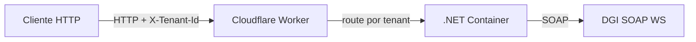

import { Aside, Tabs, TabItem, Steps } from '@astrojs/starlight/components';

## Introducción

**UruFactura.CloudflareApi** es una API HTTP construida sobre ASP.NET Core Minimal API que expone toda la funcionalidad del SDK como endpoints REST. Está diseñada para correr en [Cloudflare Containers](https://developers.cloudflare.com/containers/) pero funciona en cualquier entorno Docker o Kestrel estándar.

### Características

- Soporte **single-tenant** y **multi-tenant (SaaS)** desde la misma imagen.
- Certificado digital vía archivo o variable Base64.
- CAEs pre-cargados desde configuración (sobreviven reinicios).
- Los **13 tipos de CFE** de la DGI soportados.
- Endpoint `GET /health` para readiness probes.

---

## Arquitectura



Cada tenant obtiene su propio contenedor con estado aislado. Los contenedores se duermen tras inactividad y se relanzan automáticamente.

---

## Endpoints principales

| Método | Ruta | Descripción |
|--------|------|-------------|
| `POST` | `/cfe/xml` | Genera y firma XML (requiere `Tipo` en body) |
| `POST` | `/cfe/enviar` | Firma y envía CFE a DGI |
| `POST` | `/cfe/pdf/a4` | Genera PDF A4 |
| `POST` | `/cfe/pdf/termico` | Genera PDF térmico |
| `POST` | `/cfe/consultar` | Consulta estado en DGI |
| `POST` | `/reporte-diario` | Envía Reporte Diario |
| `POST` | `/cfe/eticket/*` | Atajos para e-Ticket |
| `POST` | `/cfe/efactura/*` | Atajos para e-Factura |
| `GET`  | `/cae` | Lista CAEs en memoria |
| `POST` | `/cae` | Registra CAE en runtime |
| `GET`  | `/health` | Health check |

---

## Configuración de un Tenant

<Steps>

1. **Elegir un `tenantId`**

   Usar solo letras, dígitos, `-` y `_`. No usar `:` ni `__`.
   Ejemplo: `empresa-abc`, `mi_empresa_01`.

2. **Definir variables de entorno**

   Cada tenant se configura bajo la sección `Tenants:{tenantId}:*`:

   ```bash
   Tenants__empresa-abc__RutEmisor=210000000001
   Tenants__empresa-abc__RazonSocialEmisor=EMPRESA ABC SA
   Tenants__empresa-abc__DomicilioFiscal=AV ITALIA 1234
   Tenants__empresa-abc__CertificadoBase64=<base64 del .p12>
   Tenants__empresa-abc__PasswordCertificado=clave123
   Tenants__empresa-abc__Ambiente=Produccion
   Tenants__empresa-abc__Caes=[{"NroSerie":"CAE001","Tipo":101,"RangoDesde":1,"RangoHasta":1000,"FechaVencimiento":"2026-12-31"}]
   ```

3. **Persistir la configuración**

   La configuración de cada tenant se persiste según el entorno de despliegue:

   | Entorno | Dónde se persiste |
   |---------|-------------------|
   | Cloudflare | `wrangler secret put Tenants__empresa-abc__*` (Cloudflare Secrets) |
   | Docker local | Variables de entorno en `docker run -e` o `docker-compose.yml` |
   | Kubernetes | ConfigMaps / Secrets montados como env vars |
   | TestApi local | `appsettings.json` o `dotnet user-secrets` |

4. **Enviar el header en cada request**

   ```http
   POST /cfe/enviar HTTP/1.1
   Content-Type: application/json
   X-Tenant-Id: empresa-abc

   { "Tipo": 101, "Numero": 1, ... }
   ```

</Steps>

<Aside type="caution" title="Seguridad multi-tenant">
  La API no implementa autenticación por sí misma. En producción, el Worker de Cloudflare (u otro reverse proxy) **debe** validar que el caller tiene permiso para usar el `X-Tenant-Id` que envía (JWT, API key, etc.).
</Aside>

---

## Persistencia de datos

| Dato | Almacenamiento | Sobrevive reinicio |
|------|---------------|-------------------|
| Configuración del tenant | Variables de entorno / Secrets | ✅ Sí |
| CAEs (desde config `Caes`) | Cargados en memoria al iniciar | ✅ Sí (se recargan) |
| CAEs (registrados vía `POST /cae`) | Solo en memoria | ❌ No |

<Aside type="tip" title="Fuente de verdad para CAEs">
  Siempre declare sus CAEs en la configuración (`Tenants:{id}__Caes`). Use `POST /cae` solo para cargas temporales durante desarrollo.
</Aside>

---

## Administración futura

En una versión futura se implementará una **web de administración** donde cada tenant podrá:

- Registrarse y gestionar su configuración (RUT, certificados, CAEs).
- Monitorear el estado de sus CFE emitidos.
- Rotar certificados digitales.

Mientras tanto, la gestión de tenants se realiza manualmente a través de variables de entorno / Cloudflare Secrets.

---

## TestApi — Entorno de desarrollo

El proyecto `UruFactura.TestApi` referencia `CloudflareApi` y agrega **Scalar UI** para exploración interactiva:

```bash
cd src/UruFactura.TestApi
dotnet run
# Abrir http://localhost:5100 → Scalar UI
```

Comparte exactamente los mismos endpoints y lógica multi-tenant. Ideal para:
- Probar integraciones antes de desplegar.
- Validar payloads de CFE.
- Depurar flujos de firma y envío a DGI (homologación).
