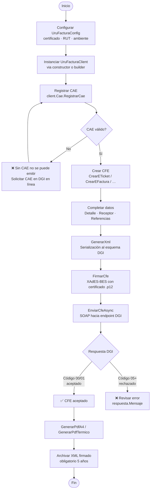
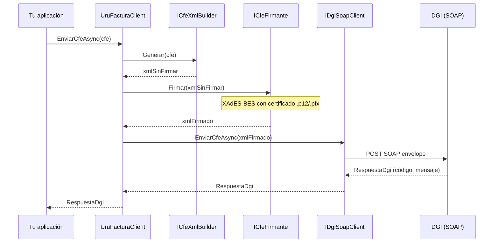
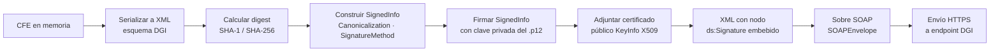
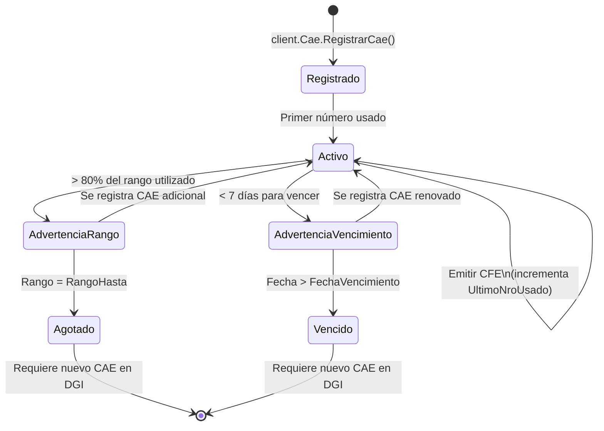
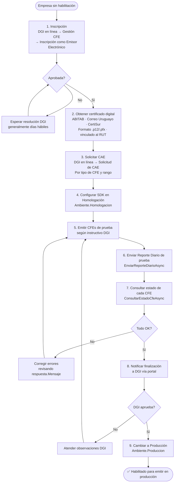
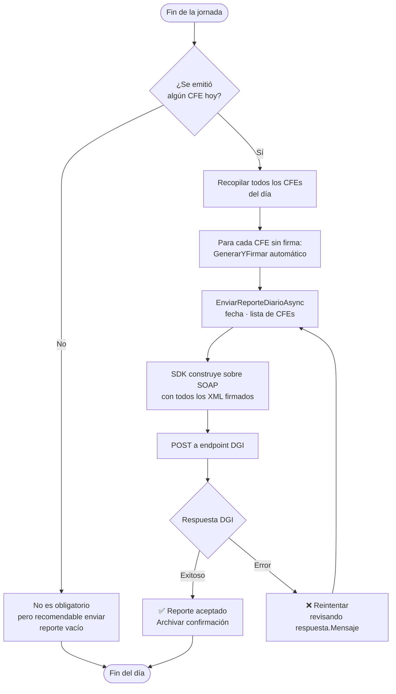
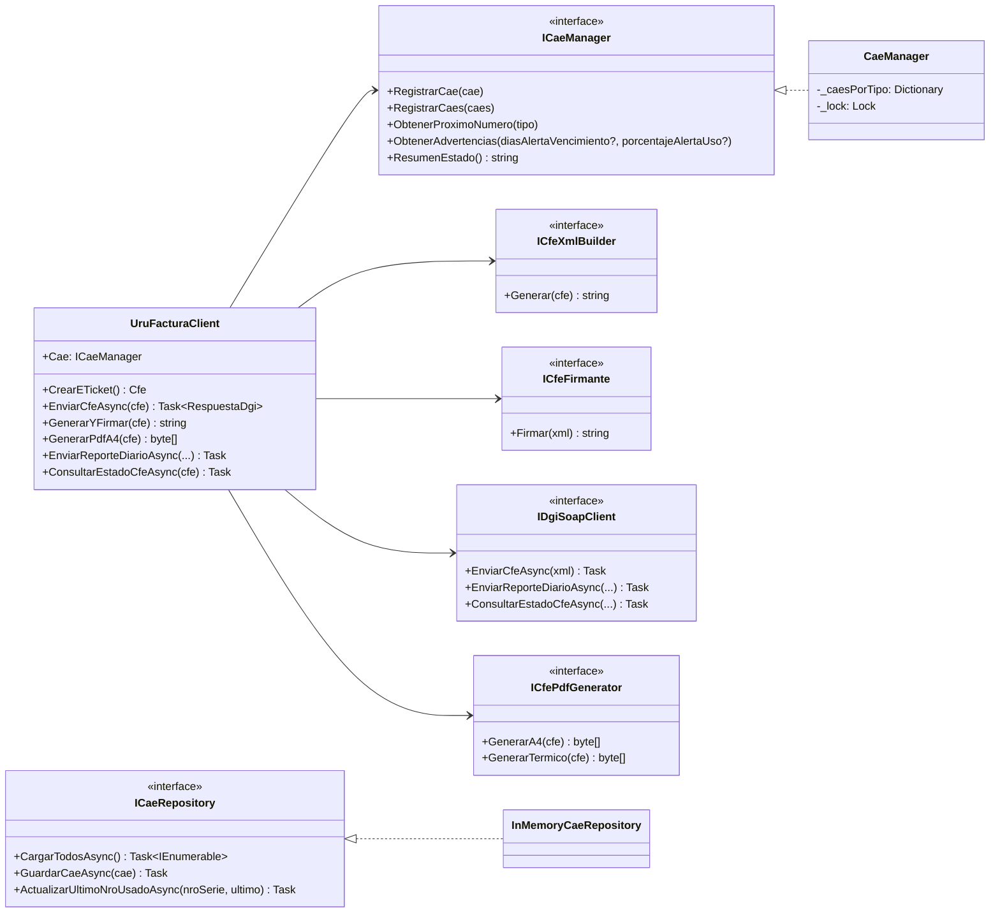

import { Aside } from '@astrojs/starlight/components';

Esta página reúne los flujos de trabajo principales del SDK en formato de diagrama para facilitar la comprensión del ciclo de vida completo de un comprobante fiscal electrónico.

---

## Flujo completo de emisión de un CFE

Desde la configuración inicial hasta obtener el PDF listo para entregar al cliente.

---

## Pipeline interno de EnviarCfeAsync

Lo que ocurre dentro del SDK al llamar a `EnviarCfeAsync`.

---

## Flujo de firma digital

Detalle del proceso de firma XAdES-BES que aplica el SDK a cada CFE.

---

## Gestión del ciclo de vida de un CAE

<Aside type="tip">
  Monitoreá los CAEs con `client.Cae.ObtenerAdvertencias()` al iniciar tu aplicación para detectar problemas antes de que bloqueen la emisión.
</Aside>

---

## Proceso de certificación DGI

Pasos necesarios para pasar de cero a emitir en producción.

---

## Flujo del Reporte Diario

DGI exige enviar un resumen de todos los CFE emitidos cada día.

<Aside type="caution">
  El Reporte Diario es **obligatorio** incluso si solo emitiste un CFE. No enviarlo puede generar infracciones ante DGI.
</Aside>

---

## Arquitectura de componentes del SDK

Relación entre las principales interfaces y quién las implementa por defecto.

