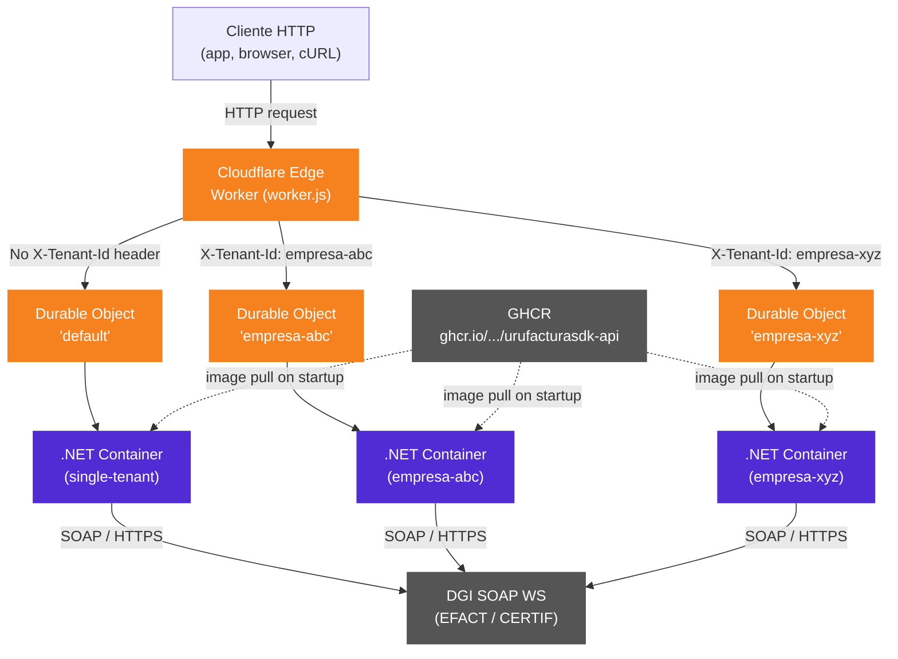
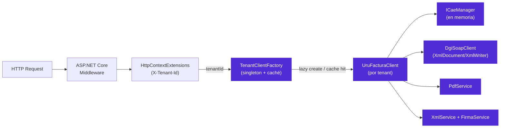
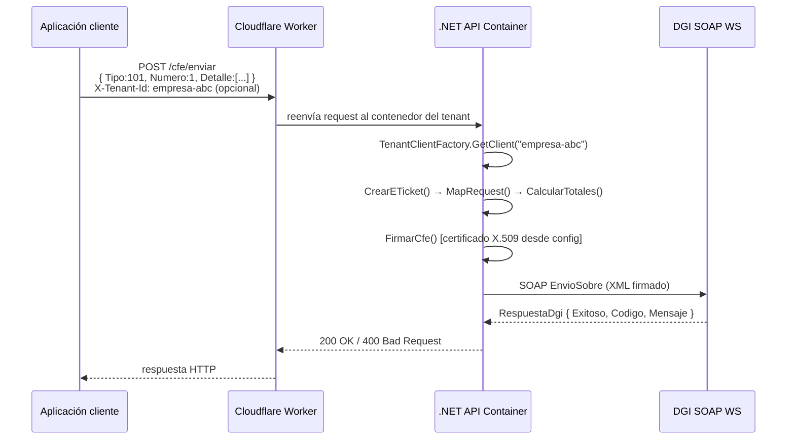
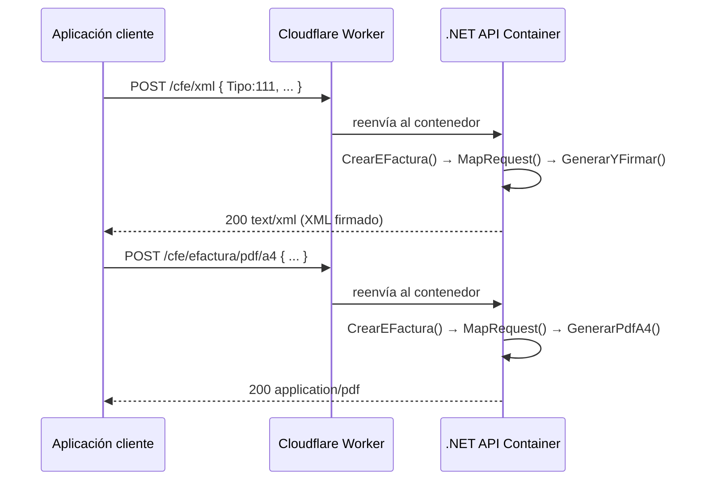
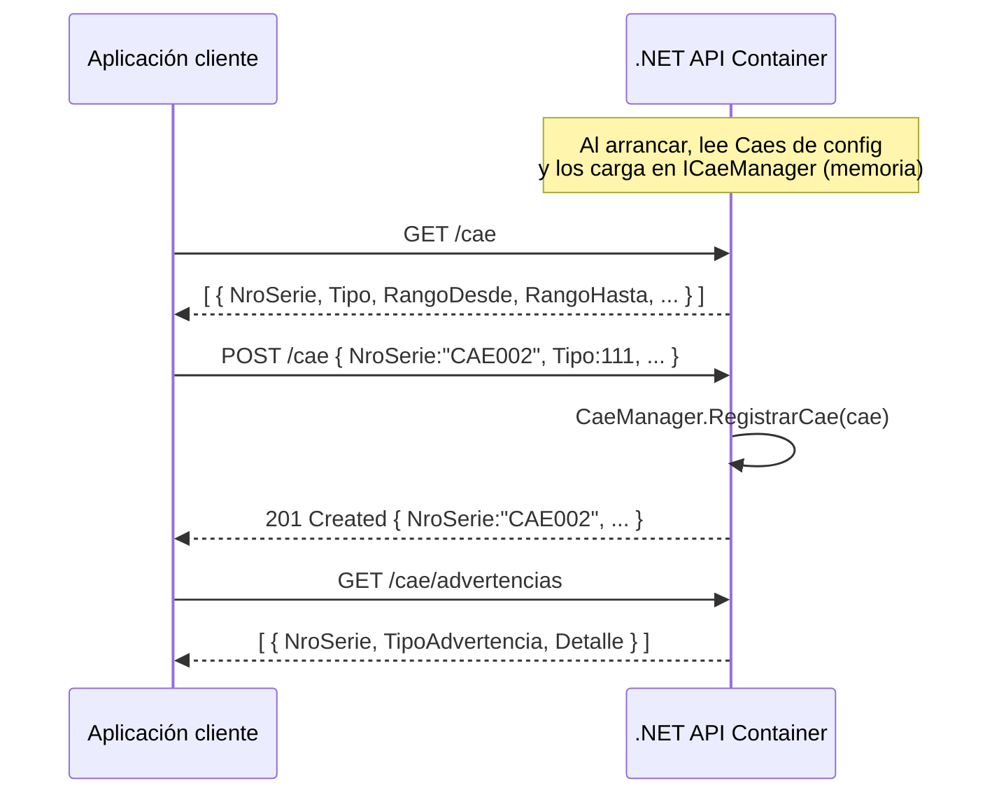

# UruFactura.CloudflareApi

API HTTP para facturación electrónica DGI Uruguay, diseñada para correr en [Cloudflare Containers](https://developers.cloudflare.com/containers/).  
Construida sobre **UruFacturaSDK** y ASP.NET Core 10 Minimal API.

---

## Contenido

- [Características](#características)
- [Requisitos](#requisitos)
- [Arquitectura e infraestructura](#arquitectura-e-infraestructura)
- [Flujos principales](#flujos-principales)
- [Variables de entorno / Configuración](#variables-de-entorno--configuración)
- [Pre-carga de CAEs](#pre-carga-de-caes)
- [Endpoints](#endpoints)
- [Build y ejecución local](#build-y-ejecución-local)
- [Despliegue en Cloudflare Containers](#despliegue-en-cloudflare-containers)
- [Multi-tenant en Cloudflare](#multi-tenant-en-cloudflare)
- [Estructura del proyecto](#estructura-del-proyecto)

---

## Características

- **Single-tenant** y **multi-tenant (SaaS)** desde la misma imagen Docker.
- Certificado digital vía archivo montado o variable de entorno Base64 (ideal para contenedores sin volúmenes).
- CAEs pre-cargados al inicio desde configuración — sobrevive reinicios del contenedor.
- Sin dependencias de UI (sin Swagger UI, sin Scalar): imagen mínima para producción.
- Cobertura completa: los **13 tipos de CFE** de la DGI están soportados.
- Endpoint `GET /health` para sondeos de disponibilidad del contenedor.

---

## Requisitos

| Herramienta | Versión mínima |
|-------------|---------------|
| .NET SDK    | 10.0          |
| Docker      | 24+           |
| Wrangler CLI | 3+           |
| Cuenta Cloudflare | Workers Paid + Containers beta |

---

## Arquitectura e infraestructura

### Vista de alto nivel



> Cada `Durable Object` gestiona exactamente un contenedor. El estado en memoria (CAEs en runtime) está **completamente aislado** por tenant. Los contenedores se duermen tras 5 minutos de inactividad (`sleepAfter = "5m"` en `worker.js`) y se relanzan automáticamente al llegar la siguiente solicitud.

### Componentes internos del contenedor (.NET)



---

## Flujos principales

### 1. Emitir y enviar un CFE (e-Ticket / e-Factura / cualquier tipo)



### 2. Generar XML y PDF sin enviar a DGI



### 3. Registro y consulta de CAEs



### 4. Flujo de CI/CD — deploy a Cloudflare

```mermaid
graph LR
    TAG["git push<br/>tag v1.2.3"]
    GHA["GitHub Actions<br/>deploy-cloudflare.yml"]
    BUILD["docker build<br/>+ push GHCR"]
    STAMP["sed wrangler.toml<br/>(image = sha-xxxxx)"]
    SECRETS["wrangler secret put<br/>(cert, creds, CAEs)"]
    DEPLOY["wrangler deploy"]
    CF_EDGE["Cloudflare Edge"]

    TAG --> GHA
    GHA --> BUILD
    BUILD --> STAMP
    STAMP --> SECRETS
    SECRETS --> DEPLOY
    DEPLOY --> CF_EDGE

    classDef gh fill:#24292e,color:#fff,stroke:none
    classDef cf fill:#f6821f,color:#fff,stroke:none
    class GHA,BUILD,STAMP,SECRETS gh
    class DEPLOY,CF_EDGE cf
```



---

## Variables de entorno / Configuración

### Single-tenant (`UruFactura:*`)

| Variable | Obligatoria | Descripción |
|----------|:-----------:|-------------|
| `UruFactura__RutEmisor` | ✅ | RUT del emisor (12 dígitos, sin puntos ni guión) |
| `UruFactura__RazonSocialEmisor` | ✅ | Razón social del emisor |
| `UruFactura__DomicilioFiscal` | ✅ | Domicilio fiscal |
| `UruFactura__RutaCertificado` | ✅* | Ruta al `.p12` montado en el contenedor |
| `UruFactura__CertificadoBase64` | ✅* | Contenido del `.p12` en Base64 (alternativa a `RutaCertificado`) |
| `UruFactura__PasswordCertificado` | ✅ | Contraseña del certificado |
| `UruFactura__Ambiente` | – | `Homologacion` (defecto) o `Produccion` |
| `UruFactura__NombreComercialEmisor` | – | Nombre comercial (opcional) |
| `UruFactura__Giro` | – | Giro / actividad económica (opcional) |
| `UruFactura__Ciudad` | – | Ciudad del emisor (defecto: `MONTEVIDEO`) |
| `UruFactura__Departamento` | – | Departamento del emisor (defecto: `MONTEVIDEO`) |
| `UruFactura__OmitirValidacionSsl` | – | `false` (defecto). Solo `true` en homologación con CA no confiable |
| `UruFactura__Caes` | – | JSON array de CAEs a pre-cargar (ver [CAEs](#pre-carga-de-caes)) |

> \* Se requiere exactamente uno de los dos (`RutaCertificado` o `CertificadoBase64`).

### Multi-tenant (`Tenants:{tenantId}:*`)

Para multi-tenant, cada empresa tiene su propia sección de configuración con las mismas claves reemplazando el prefijo `UruFactura` por `Tenants:{tenantId}`:

```
Tenants__empresa-abc__RutEmisor=210000000001
Tenants__empresa-abc__RazonSocialEmisor=EMPRESA ABC SA
Tenants__empresa-abc__CertificadoBase64=<base64>
Tenants__empresa-abc__PasswordCertificado=...
Tenants__empresa-abc__Ambiente=Produccion
Tenants__empresa-abc__Caes=[...]

Tenants__empresa-xyz__RutEmisor=210000000002
...
```

Cada solicitud debe incluir el header **`X-Tenant-Id: {tenantId}`**. Sin ese header se usa la sección `UruFactura:*`.

---

## Pre-carga de CAEs

Los CAEs se guardan en **memoria dentro del contenedor**. Al reiniciar el contenedor se pierden si no están en configuración.

### ¿Por qué la config es la fuente de verdad?

En Cloudflare Containers cada **Durable Object** corre exactamente **un** contenedor. Con la arquitectura multi-tenant del `worker.js`, cada `X-Tenant-Id` recibe su propio Durable Object → su propio contenedor → su propio estado en memoria completamente aislado. Esto significa que:

- Las llamadas `POST /cae` (registro en runtime) **afectan solo al contenedor activo** del tenant. Si el contenedor se reinicia, esos CAEs se pierden a menos que estén en la configuración.
- Las llamadas `GET /cae` devuelven los CAEs del contenedor activo del tenant.

**Recomendación:** configure siempre los CAEs vía `UruFactura__Caes` (o `Tenants:{id}__Caes`) como Cloudflare Secret. Use `POST /cae` solo para actualizaciones temporales o carga dinámica, complementando la semilla de configuración.

Provea `UruFactura__Caes` (o `Tenants:{id}__Caes`) con un JSON array:

```json
[
  {
    "NroSerie": "CAE001",
    "Tipo": 101,
    "RangoDesde": 1,
    "RangoHasta": 1000,
    "FechaVencimiento": "2026-12-31"
  }
]
```

Valores de `Tipo` (entero del enum `TipoCfe`):

| Tipo | Valor |
|------|------:|
| ETicket | 101 |
| NotaCreditoETicket | 102 |
| NotaDebitoETicket | 103 |
| EFactura | 111 |
| NotaCreditoEFactura | 112 |
| NotaDebitoEFactura | 113 |
| EFacturaExportacion | 121 |
| NotaCreditoEFacturaExportacion | 122 |
| NotaDebitoEFacturaExportacion | 123 |
| ERemitoDespachante | 131 |
| EResguardo | 151 |
| ERemito | 181 |
| NotaCreditoERemito | 182 |

---

## Endpoints

### Genéricos — todos los tipos de CFE

Usar `"Tipo"` en el body para indicar el tipo. Ver tabla de valores arriba.

| Método | Ruta | Body | Descripción |
|--------|------|------|-------------|
| POST | `/cfe/xml` | `CfeRequest` (con `Tipo`) | Genera y firma XML de cualquier CFE |
| POST | `/cfe/enviar` | `CfeRequest` (con `Tipo`) | Firma y envía cualquier CFE a la DGI |
| POST | `/cfe/pdf/a4` | `CfeRequest` (con `Tipo`) | Genera PDF A4 de cualquier CFE |
| POST | `/cfe/pdf/termico` | `CfeRequest` (con `Tipo`) | Genera PDF térmico de cualquier CFE |
| POST | `/cfe/consultar` | `ConsultarCfeRequest` | Consulta estado de un CFE en la DGI |
| POST | `/reporte-diario` | `ReporteDiarioRequest` | Envía el Reporte Diario a la DGI |

### Atajos — e-Ticket

| Método | Ruta | Descripción |
|--------|------|-------------|
| POST | `/cfe/eticket/xml` | Genera y firma XML de e-Ticket |
| POST | `/cfe/eticket/enviar` | Firma y envía e-Ticket a la DGI |
| POST | `/cfe/eticket/pdf/a4` | Genera PDF A4 de un e-Ticket |
| POST | `/cfe/eticket/pdf/termico` | Genera PDF térmico de un e-Ticket |

### Atajos — e-Factura

| Método | Ruta | Descripción |
|--------|------|-------------|
| POST | `/cfe/efactura/xml` | Genera y firma XML de e-Factura |
| POST | `/cfe/efactura/enviar` | Firma y envía e-Factura a la DGI |
| POST | `/cfe/efactura/pdf/a4` | Genera PDF A4 de una e-Factura |
| POST | `/cfe/efactura/pdf/termico` | Genera PDF térmico de una e-Factura |

### CAE (`/cae`)

| Método | Ruta | Descripción |
|--------|------|-------------|
| GET | `/cae` | Lista los CAEs en memoria |
| POST | `/cae` | Registra un CAE en tiempo de ejecución |
| GET | `/cae/advertencias` | CAEs por vencer o con alto uso |

### Health

| Método | Ruta | Descripción |
|--------|------|-------------|
| GET | `/health` | Liveness / readiness probe del contenedor |

### Schemas de request

<details>
<summary><code>CfeRequest</code></summary>

```json
{
  "Numero": 1,
  "Serie": null,
  "FormaPago": 1,
  "Moneda": 0,
  "Receptor": null,
  "Detalle": [
    {
      "NombreItem": "Servicio de consultoría",
      "Cantidad": 1,
      "PrecioUnitario": 1000,
      "IndFactIva": 3
    }
  ],
  "Tipo": 101,
  "Referencias": null,
  "IndTraslado": null,
  "TipoCambio": null,
  "FechaEmision": null
}
```

`Tipo` es obligatorio en los endpoints genéricos (`/cfe/xml`, `/cfe/enviar`, etc.) e ignorado en los atajos (`/cfe/eticket/*`).  
`Referencias` es obligatorio para notas de crédito/débito.  
`IndTraslado` es obligatorio para e-Remito y e-Remito Despachante.

</details>

<details>
<summary><code>ConsultarCfeRequest</code></summary>

```json
{
  "Tipo": 101,
  "Serie": null,
  "Numero": 1
}
```

</details>

<details>
<summary><code>ReporteDiarioRequest</code></summary>

```json
{
  "Fecha": "2026-05-16T00:00:00Z",
  "Cfes": [
    { "Tipo": 101, "Numero": 1, "Serie": null, "FormaPago": 1, "Moneda": 0, "Receptor": null, "Detalle": [...] }
  ]
}
```

</details>

<details>
<summary><code>CaeConfigRequest</code></summary>

```json
{
  "NroSerie": "CAE001",
  "Tipo": 101,
  "RangoDesde": 1,
  "RangoHasta": 1000,
  "FechaVencimiento": "2026-12-31",
  "UltimoNroUsado": 0
}
```

</details>

---

## Build y ejecución local

```bash
# Desde la raíz del repositorio

# Build de la imagen
docker build -f src/UruFactura.CloudflareApi/Dockerfile -t urufactura-api .

# Health check rápido
curl http://localhost:8080/health

# Run single-tenant (cert como archivo)
docker run -p 8080:8080 \
  -e UruFactura__RutEmisor=210000000001 \
  -e UruFactura__RazonSocialEmisor="MI EMPRESA SA" \
  -e UruFactura__DomicilioFiscal="18 DE JULIO 1234" \
  -e UruFactura__RutaCertificado=/certs/cert.p12 \
  -e UruFactura__PasswordCertificado=miclave \
  -e UruFactura__Ambiente=Homologacion \
  -v /ruta/local/cert.p12:/certs/cert.p12:ro \
  urufactura-api

# Run single-tenant (cert como Base64)
CERT_B64=$(base64 -w0 /ruta/local/cert.p12)
docker run -p 8080:8080 \
  -e UruFactura__RutEmisor=210000000001 \
  -e UruFactura__RazonSocialEmisor="MI EMPRESA SA" \
  -e UruFactura__DomicilioFiscal="18 DE JULIO 1234" \
  -e UruFactura__CertificadoBase64="$CERT_B64" \
  -e UruFactura__PasswordCertificado=miclave \
  urufactura-api

# Ejemplo de request — emitir e-Ticket
curl -X POST http://localhost:8080/cfe/eticket/enviar \
  -H "Content-Type: application/json" \
  -d '{
    "Numero": 1,
    "Serie": null,
    "FormaPago": 1,
    "Moneda": 0,
    "Receptor": null,
    "Detalle": [
      { "NombreItem": "Producto A", "Cantidad": 2, "PrecioUnitario": 500, "IndFactIva": 3 }
    ]
  }'
```

---

## Despliegue en Cloudflare Containers

### Opción A: GitHub Actions (recomendado)

El workflow `.github/workflows/deploy-cloudflare.yml` construye la imagen, la publica en GHCR, aprovisiona los secretos en Cloudflare y despliega — todo en un solo paso.

**Configurar secretos en el repositorio** (Settings → Secrets and variables → Actions):

| Secret | Valor |
|--------|-------|
| `CLOUDFLARE_API_TOKEN` | Token con permisos Workers/Containers |
| `CLOUDFLARE_ACCOUNT_ID` | ID de la cuenta Cloudflare |
| `URUFACTURA_RUT_EMISOR` | RUT del emisor (12 dígitos) |
| `URUFACTURA_RAZON_SOCIAL` | Razón social del emisor |
| `URUFACTURA_DOMICILIO_FISCAL` | Domicilio fiscal |
| `URUFACTURA_CERT_B64` | Certificado `.p12` en Base64 |
| `URUFACTURA_CERT_PASSWORD` | Contraseña del certificado |
| `URUFACTURA_CAES` | JSON array de CAEs (opcional) |

**Disparar el despliegue:**
```bash
# Manual desde la UI de GitHub → Actions → "Deploy to Cloudflare Containers" → Run workflow
# O automáticamente al hacer push de un tag:
git tag v1.2.3
git push origin v1.2.3
```

### Opción B: Manual con Wrangler

```bash
# 1. Construir y publicar la imagen
#    Nota: GHCR requiere el nombre de la imagen en minúsculas
OWNER=$(echo "<github_username>" | tr '[:upper:]' '[:lower:]')
docker build -f src/UruFactura.CloudflareApi/Dockerfile \
  -t ghcr.io/${OWNER}/urufacturasdk-api:latest .
docker push ghcr.io/${OWNER}/urufacturasdk-api:latest

# 2. Desde el directorio cloudflare/
cd cloudflare

# 3. Aprovisionar secretos (se pedirá el valor de forma interactiva)
wrangler secret put UruFactura__RutEmisor
wrangler secret put UruFactura__RazonSocialEmisor
wrangler secret put UruFactura__DomicilioFiscal
wrangler secret put UruFactura__CertificadoBase64
wrangler secret put UruFactura__PasswordCertificado
wrangler secret put UruFactura__Caes   # opcional, JSON array

# 4. Desplegar
wrangler deploy
```

> **Nota sobre casing:** `github.repository_owner` puede ser mixed-case (ej: `MathiasGonzalez`). GHCR rechaza nombres de imagen con mayúsculas. Los workflows de CI ya incluyen un paso de conversión a minúsculas. En despliegues manuales use `tr '[:upper:]' '[:lower:]'` como muestra el ejemplo anterior.

---

## Multi-tenant en Cloudflare

En modo multi-tenant, configure los secretos por tenant. El `worker.js` enruta cada `X-Tenant-Id` a su propio Durable Object → su propio contenedor con estado aislado.

```bash
# Para cada tenant:
wrangler secret put Tenants__empresa-abc__CertificadoBase64
wrangler secret put Tenants__empresa-abc__PasswordCertificado
wrangler secret put Tenants__empresa-abc__RutEmisor
wrangler secret put Tenants__empresa-abc__RazonSocialEmisor
wrangler secret put Tenants__empresa-abc__DomicilioFiscal
wrangler secret put Tenants__empresa-abc__Caes   # opcional
```

Y en cada llamada a la API agregue el header:

```
X-Tenant-Id: empresa-abc
```

Cada tenant tiene su contenedor con CAEs aislados. Los contenedores se crean la primera vez que llega una solicitud para ese tenant y se duermen tras 5 minutos de inactividad (`sleepAfter = "5m"` en `worker.js`). Consulte la [documentación de Cloudflare Containers](https://developers.cloudflare.com/containers/) para detalles.

---

## Estructura del proyecto

```
src/UruFactura.CloudflareApi/
├── Endpoints/
│   ├── CfeEndpoints.cs          # Endpoints /cfe/* y /reporte-diario
│   └── CaeEndpoints.cs          # Endpoints /cae/*
├── Models/
│   ├── CfeRequest.cs            # DTO de solicitud CFE (13 tipos)
│   ├── CaeConfigRequest.cs      # DTO de CAE (registro y seed)
│   ├── ConsultarCfeRequest.cs   # DTO para consultar estado en DGI
│   └── ReporteDiarioRequest.cs  # DTO para reporte diario DGI
├── Services/
│   ├── IUruFacturaClientFactory.cs
│   └── TenantClientFactory.cs   # Fábrica multi-tenant con caché
├── HttpContextExtensions.cs     # Helper para leer X-Tenant-Id
├── Program.cs                   # Bootstrap de la aplicación
├── Dockerfile
└── README.md (este archivo)

cloudflare/
├── worker.js                    # Cloudflare Worker (enrutamiento por tenant)
└── wrangler.toml                # Configuración de despliegue Cloudflare

.github/workflows/
├── docker.yml                   # Build & push imagen a GHCR
├── deploy-cloudflare.yml        # Deploy completo a Cloudflare Containers
└── test-cloudflare-api.yml      # Build, tests y smoke-test Docker
```

